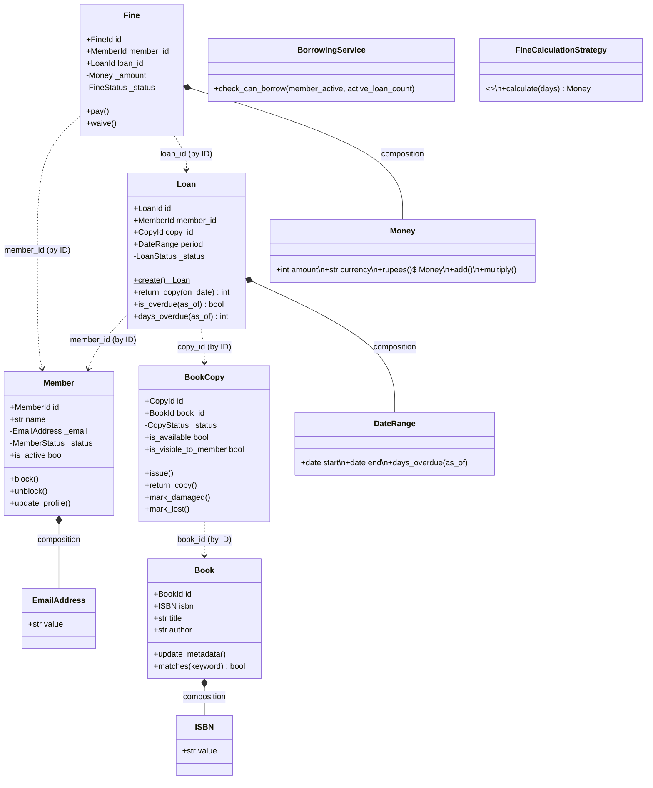
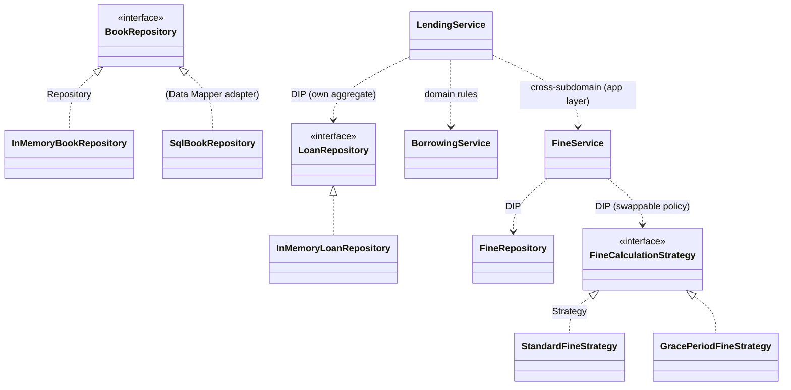
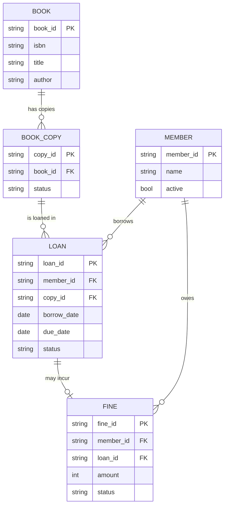
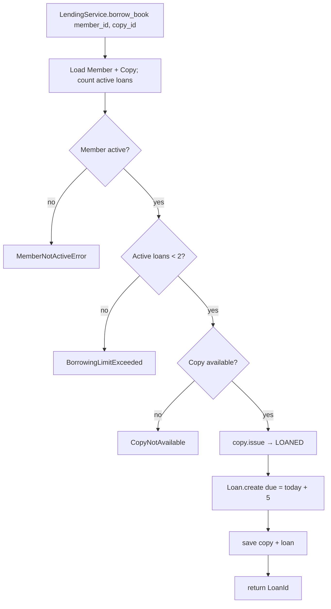

# Step 12 — Artifacts (Finale)

*Series: Designing a Library Management System with DDD · Chapter 12 of 12*

---

Your `lld_basics.excalidraw` ends the DDD process with a checklist of deliverables: *class diagrams, ER diagrams, a user-journey/activity view, and the directory structure + framework*. This closing chapter produces all of them in one place — a reference you can hand to a new engineer (or a blog reader) — and then steps back for a retrospective: **every design decision, mapped to the principle that drove it.**

(Diagrams use Mermaid, which renders on GitHub. For Substack/LinkedIn, export them as images.)

---

## 12.1 Final directory structure

> **Note — this is the *as-built* layout, and it's organized subdomain-first (vertical slices), not layer-first.** An earlier draft of this series drew a single flat `src/domain | application | infrastructure | api`. We deliberately changed course (Step 8a): each **subdomain** is a self-contained slice with its *own* four layers, so a future microservice split is a **lift-out of a folder**, not a re-architecture. The layer rules still hold *inside* each slice; the tree just groups by *subdomain first, layer second*.

```
library_management_system_v2/
├── REQUIREMENTS.md · CLAUDE.md · pyproject.toml · Makefile
├── docs/                                    ← this 12-part series
├── tests/                                   ← pytest (mirrors src/ by slice)
└── src/
    ├── shared/                              ← SHARED KERNEL (tiny, stable, dependency-free)
    │   ├── ids.py                           EntityId + Book/Copy/Member/Loan/FineId
    │   ├── base_repo.py                     Repository[ID, T]  (generic port)
    │   └── exceptions.py                    DomainError · EntityNotFound · EntityAlreadyExists
    │
    ├── catalog/                             ← SUPPORTING subdomain (one full vertical slice)
    │   ├── domain/         book.py · bookcopy.py · isbn.py · enums.py · exceptions.py
    │   │                   repository/{book_repo, book_copy_repo}.py    ← ports
    │   ├── application/    catalog_service.py
    │   ├── infrastructure/ inmemory_book_repo.py · inmemory_bookcopy_repo.py · sql_book_repo.py
    │   └── api/            controller.py · dtos.py · dependencies.py    (thin)
    │
    ├── membership/                          ← SUPPORTING
    │   ├── domain/         member.py · email.py · enums.py · exceptions.py · repository.py
    │   ├── application/    membership_service.py
    │   └── infrastructure/ inmemory_membership_repository.py
    │
    ├── lending/                             ← CORE (the lavish-modeling subdomain)
    │   ├── domain/         loan.py (aggregate root) · daterange.py · enums.py · exceptions.py
    │   │                   borrowing_service.py (domain service) · repository.py
    │   ├── application/    lending_service.py   (composes catalog + membership + fines by ID/port)
    │   └── infrastructure/ inmemory_loan_repository.py
    │
    ├── fines/                               ← SUPPORTING
    │   ├── domain/         fine.py · money.py · enums.py · exceptions.py
    │   │                   fine_calculation.py (Strategy) · repository.py
    │   ├── application/    fine_service.py
    │   └── infrastructure/ inmemory_fine_repository.py
    │
    ├── notifications/                       ← GENERIC (scaffolded; a Notifier port when needed)
    │
    ├── app.py                               ← FastAPI app + central error handlers
    └── main.py                              ← composition root + demo harness (no web, no DB)
```

The layout *is* the architecture — but the primary axis is the **subdomain**, not the layer. Inside each slice, dependencies still point inward (`domain/` imports nothing but `shared/`); **across** slices, no slice imports another's internals — cross-slice references are **by ID**, composed only at the **application** layer (e.g. `lending` calls `catalog`/`membership`/`fines` through their public interfaces). That is exactly what makes each slice a lift-out.

---

## 12.2 Use-case view (actors → use cases)


---

## 12.3 Domain class diagram



`*--` (composition) = inside an aggregate (Step 6); `..>` (dependency/by-ID) = across aggregates. Five single-entity aggregates, every cross-reference an ID.

> **Two deliberate divergences from an earlier draft — both worth being able to defend:**
> - **`BorrowingService` has *no* arrows to `Member`/`BookCopy`.** It takes plain **values** (`member_active: bool`, `active_loan_count: int`), not foreign entities (§9.3.2, "Option 1"). That's what keeps the `lending` slice from importing `membership`/`catalog` — the application service gathers the values and hands them down.
> - **`Loan` carries a `LoanStatus` enum-guard, not a `LoanState` object.** We did **not** use the State pattern (for `Loan` *or* `BookCopy`) — there's no divergent per-state behavior to justify it (§8b). State earns its place only when each state needs *different code*; an enum + a guarded transition is the KISS choice here.

## 12.4 Pattern & layer diagram



There is **no single `LibraryService`** — each subdomain owns its own thin application service (`CatalogService`, `MembershipService`, `LendingService`, `FineService`). `LendingService` is the one that *composes* others, and it does so only through their **public interfaces** (a repository port for reads, `FineService` for the fine command) — never by importing their domain internals.

---

## 12.5 ER diagram (the persistence view)



Every by-ID reference became a foreign key; every aggregate root became a table — exactly as Step 6 predicted.

## 12.6 Activity diagram — the *borrow* flow



The first two diamonds are `BorrowingService.check_can_borrow` — evaluated in that order (**member active first, then the ≤2 limit**), on plain **values**; the third is `BookCopy.issue()`'s *own* guard, raised only when we actually try to issue. Decisions = domain, steps = application; the flow is entirely framework-free (driven here by `main.py`). At an HTTP edge these three errors map to **409**s via the single central handler (§11) — but that mapping lives in `app.py`, not in this flow.

---

## 12.7 Retrospective: decision → principle

The heart of the series in one table — *why* each decision was made, not just *what*:

| Decision | Driven by | Step |
|---|---|---|
| Built a glossary before any class | Ubiquitous Language | 1 |
| Split `Book` vs `BookCopy` | The right abstraction; per-copy rules | 1 |
| One bounded context, no microservices | KISS / match design to scale | 1 |
| `Money`/`ISBN`/typed IDs as value objects | Encapsulation, kill primitive obsession | 3, 8a |
| Invariants enforced in constructors/methods | Make illegal states unrepresentable | 4, 8 |
| Separated "₹5/day" (policy) from "Money ≥ 0" (invariant) | Policy vs invariant → Strategy seam | 4, 8b |
| Five small aggregates, reference by ID | Small aggregates, low coupling, low contention | 5 |
| `Member` does **not** count its own loans | Aggregate boundary as a responsibility limit | 5, 7 |
| Unidirectional by-ID references | Single source of truth, small aggregates | 6 |
| **Subdomain-first vertical slices** + shared kernel | Modularity + split-readiness (a slice is a lift-out) | 8a |
| Rich entities with guarded commands | Tell-Don't-Ask, Information Expert, anti-anemic | 7, 8 |
| `Loan` **and** `BookCopy` = enum-guard, **not** State pattern | KISS — no divergent per-state behavior to justify State | 8b |
| Domain service takes **values**, not foreign entities | No cross-subdomain coupling (Option 1) → slice stays a lift-out | 9 |
| Cross-subdomain writes via **public app services** (lending→fines) | Composition lives at the application layer only | 9 |
| Fine calculation as a Strategy | OCP / LSP / DIP — swappable policy | 8b |
| `Loan.create()` factory | Guarantee creation invariants | 8b |
| Domain service vs application service split | SRP — rules vs orchestration | 9 |
| `Clock`/`Notifier` ports | DIP, testability | 9 |
| Repository interface in domain, impl in infra | DIP, persistence ignorance | 10 |
| DTOs at the API; entities never serialized | Information hiding, stable contract | 11 |
| One `DomainError` → HTTP handler | OCP at the error boundary | 11 |
| Rule #6 as a role-based query filter | Separation of invariant vs visibility | 4, 11 |

## 12.8 Where each pattern & principle lives

- **OOP:** Encapsulation (every VO/entity), Composition over inheritance (entities ◆ VOs), Abstraction (Book/BookCopy), Tell-Don't-Ask (entity commands).
- **SOLID:** SRP (layers, services), OCP (fine Strategy, central error handler), LSP (strategies/repos substitutable), ISP (per-aggregate repo interfaces), DIP (repos, ports, composition root).
- **Architecture:** **Modular monolith / vertical slices** (subdomain-first), **Ports & Adapters** (repository ports in `domain/`, adapters in `infrastructure/`; inbound adapters at `api/`), **Shared Kernel** (`src/shared/`), cross-slice references **by ID** — all chosen for split-readiness at one-context scale.
- **GoF patterns actually built:** **Strategy** (fine calc — `Standard` + `GracePeriod`), **Factory Method** (`Loan.create`, `Money.rupees`), **Repository** + **Data Mapper** (`SqlBookRepository` maps `Book` ⇄ ORM row, keeping the domain pure).
- **Patterns deliberately *not* built (and why we can point to where they'd go):** **State** — an enum-guard covered `Loan`/`BookCopy` with no divergent per-state behavior; **Observer / domain events** — a direct `Notifier` call suffices until reactions multiply.
- **GRASP:** Information Expert (responsibility placement), Low Coupling / High Cohesion (the slice boundaries).
- **Restraint principles:** KISS / YAGNI / DRY throughout — the reason we *didn't* split into microservices, *didn't* force the State pattern on `Loan`/`BookCopy`, and *didn't* build a domain-event bus we don't yet need.

---

## 12.9 What we'd build next (and what we deliberately didn't)

Honest scope boundaries — each one a *conscious* deferral, not an oversight:

| Deferred | Why it was right to defer | When to add it |
|---|---|---|
| Real database (SQL) across all slices | Persistence is a detail; in-memory ran the whole model. A SQL adapter (`catalog/infrastructure/sql_book_repo.py`) already **demonstrates** the Data-Mapper swap for one aggregate | The other aggregates follow the identical pattern — domain/application unchanged |
| Authentication/roles | Generic subdomain, not core | Plug in at the API edge |
| Domain events + Observer | KISS — one notifier call suffices now | When reactions multiply (notify + log + stats) |
| CQRS / read models | No read/write scaling pressure at 100 members | If queries dwarf writes |
| Tests | (You'd write these alongside — pure domain makes them trivial) | Continuously |

> The recurring theme of the whole series: **every "we didn't do X" was a decision, justified by scale and the problem at hand — not a gap.** Knowing what to leave out is the senior skill.

---

## 12.10 The one-paragraph summary of the whole journey

We started with a flat requirements doc and a temptation to type `class Book`. Instead we built a **shared language**, mapped the **use cases**, classified concepts into **entities and value objects**, pinned down **invariants**, derived **aggregate boundaries** from those invariants, formalized **relationships by ID**, wrote each aggregate's **responsibilities**, then turned all of it into **code** — value objects, rich entities, the **Strategy** and **State** patterns where (and only where) a real problem demanded them. We gave cross-aggregate logic a home in **domain services**, orchestrated use cases in **thin application services**, hid storage behind **repository interfaces**, and exposed it all through a **thin API** — with SOLID as the constant background check and design patterns earning their place rather than being imposed. The result runs in pure Python, swaps its database with a one-line change, and — most importantly — **reads like the business it models.**

---

*Series complete. Thank you for following along — the design is done, the model is sound, and every decision has a reason you can point to. Go build something.*
