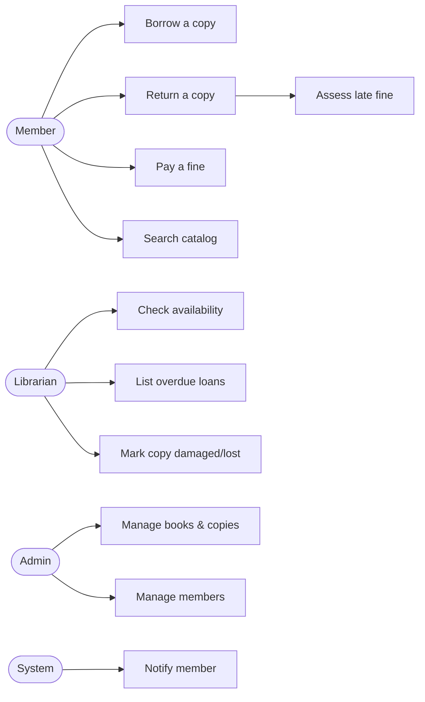
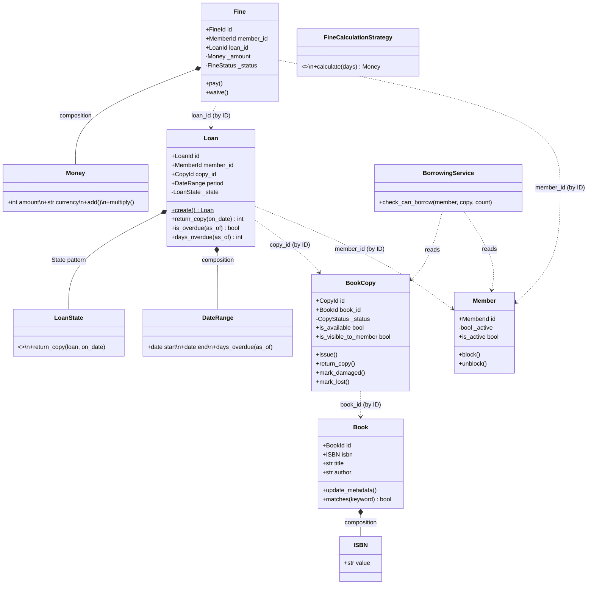
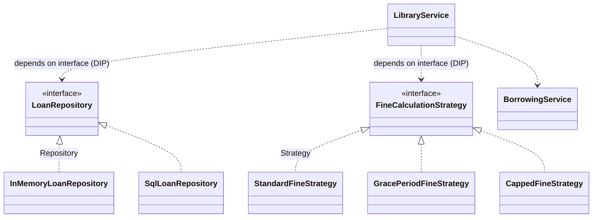
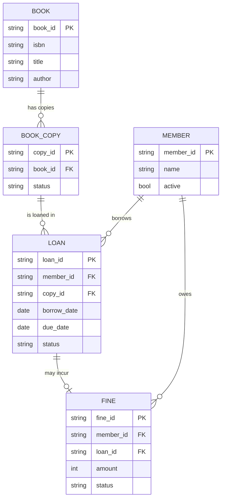
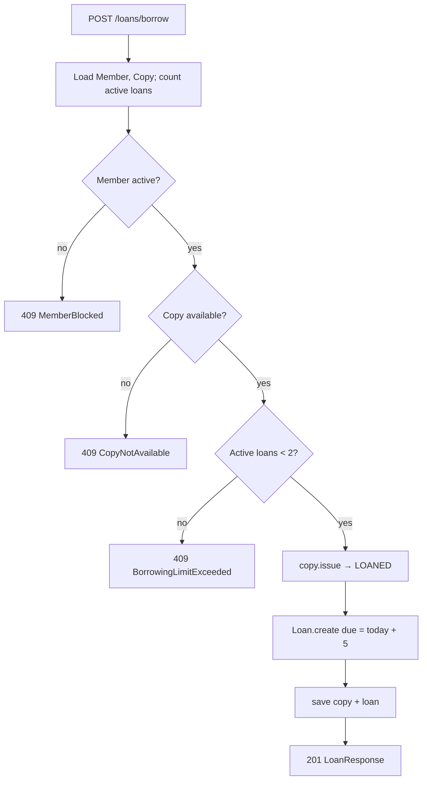

# Step 12 — Artifacts (Finale)

*Series: Designing a Library Management System with DDD · Chapter 12 of 12*

---

Your `lld_basics.excalidraw` ends the DDD process with a checklist of deliverables: *class diagrams, ER diagrams, a user-journey/activity view, and the directory structure + framework*. This closing chapter produces all of them in one place — a reference you can hand to a new engineer (or a blog reader) — and then steps back for a retrospective: **every design decision, mapped to the principle that drove it.**

(Diagrams use Mermaid, which renders on GitHub. For Substack/LinkedIn, export them as images.)

---

## 12.1 Final directory structure

```
library_management_system_v2/
├── REQUIREMENTS.md
├── docs/                                  ← this 12-part series
└── src/
    ├── domain/                            ← PURE business logic (no framework imports)
    │   ├── ids.py                         BookId, CopyId, MemberId, LoanId, FineId
    │   ├── enums.py                       CopyStatus, LoanStatus, FineStatus
    │   ├── value_objects.py               Money, ISBN, DateRange
    │   ├── exceptions.py                  DomainError hierarchy
    │   ├── entities/
    │   │   ├── book.py · book_copy.py · member.py · fine.py
    │   │   ├── loan.py                     (aggregate root)
    │   │   └── loan_state.py               State pattern: ActiveState, ReturnedState
    │   ├── services/
    │   │   ├── borrowing.py                BorrowingService (domain service)
    │   │   └── fine_calculation.py         FineCalculationStrategy (+ Standard/Grace/Capped)
    │   └── repositories/                   ← INTERFACES (ports)
    │       ├── base.py                     Repository[ID, T]
    │       └── {book,book_copy,member,loan,fine}_repository.py
    ├── application/                        ← use-case orchestration
    │   ├── services.py                     LibraryService
    │   ├── dtos.py                          LoanView, ReturnView
    │   └── ports.py                         Clock, Notifier
    ├── infrastructure/                     ← ADAPTERS (implementations)
    │   ├── memory/                          InMemory*Repository
    │   └── sql/                             Sql*Repository (when a real DB is added)
    ├── api/                                ← thin HTTP layer
    │   ├── main.py · dtos.py · errors.py · dependencies.py
    │   └── controllers/                     book · loan · member
    └── composition.py                      ← composition root (wires it all)
```

The layout *is* the architecture: four layers, dependencies pointing inward, `domain/` importing nothing.

---

## 12.2 Use-case view (actors → use cases)



---

## 12.3 Domain class diagram



`*--` (composition) = inside an aggregate (Step 6); `..>` (dependency/by-ID) = across aggregates. Five single-entity aggregates, every cross-reference an ID.

## 12.4 Pattern & layer diagram



---

## 12.5 ER diagram (the persistence view)



Every by-ID reference became a foreign key; every aggregate root became a table — exactly as Step 6 predicted.

## 12.6 Activity diagram — the *borrow* flow



The three diamonds are the `BorrowingService` rules; everything below them is orchestration. Decisions = domain, steps = application.

---

## 12.7 Retrospective: decision → principle

The heart of the series in one table — *why* each decision was made, not just *what*:

| Decision | Driven by | Step |
|---|---|---|
| Built a glossary before any class | Ubiquitous Language | 1 |
| Split `Book` vs `BookCopy` | The right abstraction; per-copy rules | 1 |
| One bounded context, no microservices | KISS / match design to scale | 1 |
| `Money`/`ISBN`/typed IDs as value objects | Encapsulation, kill primitive obsession | 3, 8a |
| Invariants enforced in constructors/methods | Make illegal states unrepresentable | 4, 8 |
| Separated "₹5/day" (policy) from "Money ≥ 0" (invariant) | Policy vs invariant → Strategy seam | 4, 8b |
| Five small aggregates, reference by ID | Small aggregates, low coupling, low contention | 5 |
| `Member` does **not** count its own loans | Aggregate boundary as a responsibility limit | 5, 7 |
| Unidirectional by-ID references | Single source of truth, small aggregates | 6 |
| Rich entities with guarded commands | Tell-Don't-Ask, Information Expert, anti-anemic | 7, 8 |
| `BookCopy` = transition table, not State pattern | KISS — no divergent per-state behavior | 8b |
| Fine calculation as a Strategy | OCP / LSP / DIP — swappable policy | 8b |
| `Loan.create()` factory | Guarantee creation invariants | 8b |
| Domain service vs application service split | SRP — rules vs orchestration | 9 |
| `Clock`/`Notifier` ports | DIP, testability | 9 |
| Repository interface in domain, impl in infra | DIP, persistence ignorance | 10 |
| DTOs at the API; entities never serialized | Information hiding, stable contract | 11 |
| One `DomainError` → HTTP handler | OCP at the error boundary | 11 |
| Rule #6 as a role-based query filter | Separation of invariant vs visibility | 4, 11 |

## 12.8 Where each pattern & principle lives

- **OOP:** Encapsulation (every VO/entity), Composition over inheritance (entities ◆ VOs), Abstraction (Book/BookCopy), Tell-Don't-Ask (entity commands).
- **SOLID:** SRP (layers, services), OCP (fine Strategy, error handler), LSP (strategies/repos substitutable), ISP (per-aggregate repo interfaces), DIP (repos, ports, composition root).
- **GoF patterns:** **Strategy** (fine calc), **State** (loan lifecycle), **Factory Method** (`Loan.create`), **Repository** (persistence), plus the **Decorator** idea in `CappedFineStrategy` and where **Observer** would slot in (domain events for notifications).
- **GRASP:** Information Expert (responsibility placement).
- **Restraint principles:** KISS / YAGNI / DRY throughout — the reason we *didn't* use microservices, *didn't* force the State pattern on `BookCopy`, and *didn't* build a domain-event bus we don't yet need.

---

## 12.9 What we'd build next (and what we deliberately didn't)

Honest scope boundaries — each one a *conscious* deferral, not an oversight:

| Deferred | Why it was right to defer | When to add it |
|---|---|---|
| Real database (SQL) | Persistence is a detail; in-memory ran the whole model | Step 11's adapter swap — interfaces ready |
| Authentication/roles | Generic subdomain, not core | Plug in at the API edge |
| Domain events + Observer | KISS — one notifier call suffices now | When reactions multiply (notify + log + stats) |
| CQRS / read models | No read/write scaling pressure at 100 members | If queries dwarf writes |
| Tests | (You'd write these alongside — pure domain makes them trivial) | Continuously |

> The recurring theme of the whole series: **every "we didn't do X" was a decision, justified by scale and the problem at hand — not a gap.** Knowing what to leave out is the senior skill.

---

## 12.10 The one-paragraph summary of the whole journey

We started with a flat requirements doc and a temptation to type `class Book`. Instead we built a **shared language**, mapped the **use cases**, classified concepts into **entities and value objects**, pinned down **invariants**, derived **aggregate boundaries** from those invariants, formalized **relationships by ID**, wrote each aggregate's **responsibilities**, then turned all of it into **code** — value objects, rich entities, the **Strategy** and **State** patterns where (and only where) a real problem demanded them. We gave cross-aggregate logic a home in **domain services**, orchestrated use cases in **thin application services**, hid storage behind **repository interfaces**, and exposed it all through a **thin API** — with SOLID as the constant background check and design patterns earning their place rather than being imposed. The result runs in pure Python, swaps its database with a one-line change, and — most importantly — **reads like the business it models.**

---

*Series complete. Thank you for following along — the design is done, the model is sound, and every decision has a reason you can point to. Go build something.*
